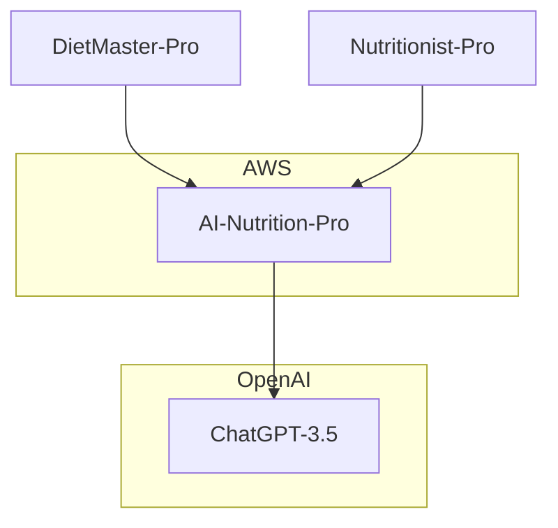

# AI Nutrition-Pro

## Business Background

Dietitians use online applications to create meals, design diets, and calculate calories, known as meal planners. Different professionals have unique methods of creating diets, which adds a personal touch to their work. Large Language Models (LLMs) can replicate this personal style of writing based on samples of existing content. Meal planners can utilize LLMs to expedite diet creation for dietitians.

## Project Overview

AI Nutrition-Pro will be a backend API application capable of integrating with any meal planner application for dietitians. It will replicate the personal style of a nutrition specialist based on provided samples.

Dietitians will not interact with the application directly; instead, they will access it through their meal planner applications. There will be no user interface exposed to dietitians. Integration will occur via the backend of meal plan applications.

The direct clients of AI Nutrition-Pro will be applications like DietMaster Pro, Nutritionist Pro, and others. These clients will send samples of content to AI Nutrition-Pro, which will generate the requested type of content based on those samples. AI Nutrition-Pro will use LLM to generate the requested content.

## Core Features

- Multi-tenant API application, where each tenant is a client application like DietMaster Pro, Nutritionist Pro, or others.
- Each tenant can include multiple dietitians.
- Each dietitian can have multiple customers.
- The application will be deployed in the AWS cloud and will utilize cloud-based services to store and process data.
- The application will store and process Personally Identifiable Information (PII) that may include personal health data of customers.
- ChatGPT 3.5 will be used as the LLM.

## High-Level Connection View

